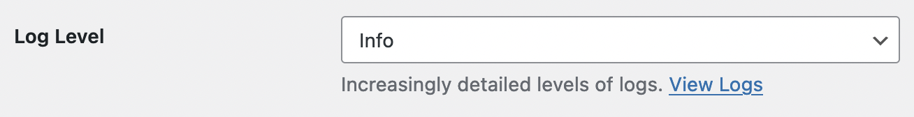
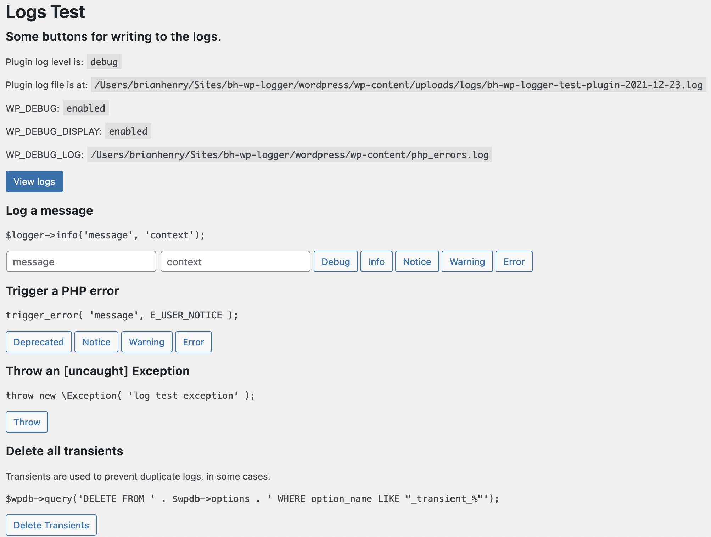

[](https://brianhenryie.github.io/bh-wp-emails/) 

# BH WP Logger

Zero-config logger UI for WordPress plugins.

```php
$logger = Logger::instance();
```

Wraps existing [PSR-3](https://www.php-fig.org/psr/psr-3/) loggers and adds some UI.

* [KLogger](https://github.com/katzgrau/KLogger)
* [WC_Logger](https://github.com/woocommerce/woocommerce/blob/trunk/includes/class-wc-logger.php)
* [PSR-3 NullLogger](https://github.com/php-fig/log/blob/master/Psr/Log/NullLogger.php)

Uses KLogger by default, WC_Logger when specified, NullLogger when log level is set to "none".

Uses PHP's `set_error_handler()` to catch PHP deprecated/warning/notice/errors.

Hook into WordPress's deprecated function hooks (`deprecated_function_run` etc.) to log those only once per day.

Uses PHP's `register_shutdown_function()` to catch Exceptions related to the plugin.

Deletes log files older than 30 days on cron.

Records a full backtrace on errors. Records two steps of backtrace on every log when the level is Debug.

## UI 

Displays logs in `WP_List_Table`.


Shows a dismissable admin error notice each time there is a new error.


Adds a link to the logs view on the plugin's entry on plugins.php.


## Use

### Composer

This library is not on Packagist yet, so first add this repo:

`composer config repositories.brianhenryie/bh-wp-logger git https://github.com/brianhenryie/bh-wp-logger`

The reason being it is using a fork of [wptrt/admin-notices](https://github.com/WPTT/admin-notices) because of [a race condition in Firefox](https://github.com/WPTT/admin-notices/issues/14). So also add that repo:

`composer config repositories.wptrt/admin-notices git https://github.com/brianhenryie/admin-notices`

It uses [brianhenryie/bh-wp-private-uploads](https://github.com/BrianHenryIE/bh-wp-private-uploads) to ensure the logs directory is not publicly accessible, so add that repo:

`composer config repositories.brianhenryie/bh-wp-private-uploads git https://github.com/brianhenryie/bh-wp-private-uploads`

Then require as normal:

`composer require brianhenryie/bh-wp-logger`

### Instantiate

You should use [brianhenryie/strauss](https://github.com/BrianHenryIE/strauss) to prefix the library's namespace. Then Strauss's autoloader will include the files for you. Otherwise:

Include the files:

```php
// Use a PSR-4 autoloader for the bh-wp-logger dependencies.

// Use this for its own files.
require_once '/path/to/bh-wp-logger/autoload.php';
```

The following will work, but it will be faster and more reliable to provide the settings:

```php
$logger = Logger::instance();
```

Provide the settings:

```php
$logger_settings = new class() implements BrianHenryIE\WP_Logger\API\Logger_Settings_Interface {
    use BrianHenryIE\WP_Logger\Logger_Settings_Trait;
    
	public function get_log_level(): string {
		return LogLevel::INFO;
	}

	// This is used in admin notices.
	public function get_plugin_name(): string {
		return "My Plugin Name";
	}

	// This is used in option names and URLs.
	public function get_plugin_slug(): string {
		return "my-plugin-name";
	}

	// This is needed for the plugins.php logs link.
	public function get_plugin_basename(): string {
		return "my-plugin-name/my-plugin-name.php";
	}
};
$logger = Logger::instance( $logger_settings );
```

Then pass around your `$logger` instance; use `NullLogger` in your tests.

After the logger has been instantiated once, subsequent calls to `::instance()` return the existing instance and any `$logger_settings` passed is ignored.

To use WooCommerce's native `WC_Logger`, use the `WooCommerce_Logger_Interface` interface (which just extends `Logger_Settings_Interface`) on the settings object.

```php
$logger_settings = new class() implements BrianHenryIE\WP_Logger\WooCommerce\WooCommerce_Logger_Settings_Interface {
    ...
```

### WooCommerce Settings

Something like this can be used for WooCommerce Settings API.

```php

$log_levels        = array( 'none', LogLevel::ERROR, LogLevel::WARNING, LogLevel::NOTICE, LogLevel::INFO, LogLevel::DEBUG );
$log_levels_option = array();
foreach ( $log_levels as $log_level ) {
    $log_levels_option[ $log_level ] = ucfirst( $log_level );
}

$setting_fields[] = array(
    'title'    => __( 'Log Level', 'text-domain' ),
    'label'    => __( 'Enable Logging', 'text-domain' ),
    'type'     => 'select',
    'options'  => $log_levels_option,
    'desc'    => __( 'Increasingly detailed levels of logs. ', 'text-domain' ) . '<a href="' . admin_url( 'admin.php?page=plugin-slug-logs' ) . '">View Logs</a>',
    'desc_tip' => false,
    'default'  => 'notice',
    'id'       => 'text-domain-log-level',
);
```



## WP_Mock

If using WP_Mock for your tests, and you are instantiating this logger, the following should help:

```php
\Patchwork\redefine(
    array( Logger::class, '__construct' ),
    function( $settings ) {}
);
```

### Test Plugin

The `test-plugin` folder contains a small plugin with buttons to trigger the types of errors that can be logged.



### Best Practice

From my limited logging experience, I find it useful to add a `debug` log at the beginning of functions and an appropriate `info`...`error` as the function returns.

## TODO

* ~~Check log directory is not publicly accessible~~
* Check uploads dir chmod (is writable). => see [brianhenryie/bh-wp-private-uploads](https://github.com/BrianHenryIE/bh-wp-private-uploads)
* Add current user to context
* Don't log empty context (WC)
* Option for what level of errors to display as admin notices
* Option for user capability for displaying admin notices (filter, at least)
* Zero-config WC_Logger: detect "wc", "woo" in plugin names
* Use [Code prettify](https://github.com/googlearchive/code-prettify) on the context json
* Paging and filtering
* Hyperlinks in messages
* ~~Record timestamp the logs were last viewed at, make the plugins.php link bold if new logs are present.~~
* ~~Auto-delete old logs~~
* ~~Log notice should dismiss when the log page is visited~~
* Redact sensitive data. e.g. use `userid:123` in the saved logs and replace it with richer data when displaying them

# Status

Very much a v0.x.

I'll start at Semver 1.0.0 once I've caught up with WPCS, PhpStan and PhpUnit. There's about 65 tests and 43% coverage. WPCS + PHPStan are both pretty good.
