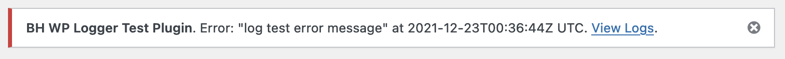
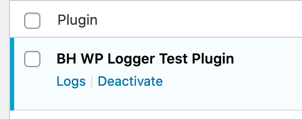

# BH WP Logger

Wraps existing PSR-3 loggers and adds some UI.

* [PSR-3](https://www.php-fig.org/psr/psr-3/)
* [KLogger](https://github.com/katzgrau/KLogger)
* [WC_Logger](https://github.com/katzgrau/KLogger)

Uses KLogger by default, WC_Logger when WooCommerce is active, NullLogger when log level is set to "none".

## UI 

Displays logs in `WP_List_Table`.


Show a dismissable admin error notice each time there is a new error.



Adds a link to the logs view on the plugin's entry on plugins.php.




## Use

### Composer

```json
"repositories": [
    {
      "url": "https://github.com/BrianHenryIE/bh-wp-logger",
      "type": "git"
    },

"require": {
    "brianhenryie/wp-logger": "dev-master"
```

If you're using [Mozart](https://github.com/coenjacobs/mozart) for namespace prefixing, you can configure it to not copy KLogger's files twice (we just need one of its PSR-4 and classmap autoloaders )


```json
    "mozart": {
      "override_autoload": {
        "katzgrau/klogger": {
          "psr-4": {
            "Katzgrau\\KLogger\\": "src/"
          }
        }
      }
```

### Instantiate

```php
// Use a PSR-4 autoloader for the bh-wp-logger dependencies.

// Use this for its own files.
require_once '/path/to/bh-wp-logger/autoload.php';

$logger_settings = new class() implements Logger_Settings_Interface {

    public function get_log_level(): string {
        return get_option( 'my-plugin-log-level', LogLevel::NOTICE );
    }

    public function get_plugin_slug(): string {
        return 'bh-wp-logger-test-plugin';
    }
};

$logger = Logger::instance( $logger_settings );
```

Then pass around your `$logger` instance; use `NullLogger` in your tests.

### Best Practice

From my brief experience using this, I find it useful to add a `debug` log at the beginning of every function and an appropriate `info`...`error` as the function returns.

## TODO

* Auto-delete old logs
* Check log directory is not publicly accessible
* Use [Code prettify](https://github.com/googlearchive/code-prettify) on the context json
* Paging and filtering
* Hyperlinks in messages

# Status

Very much a v0.1.